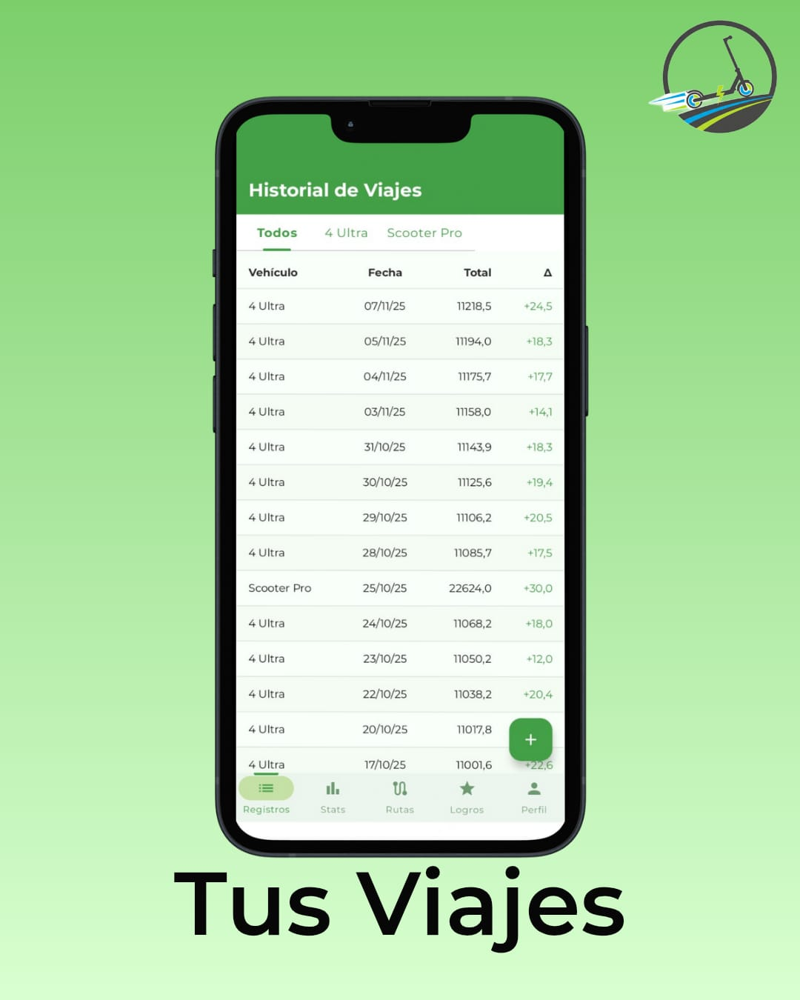
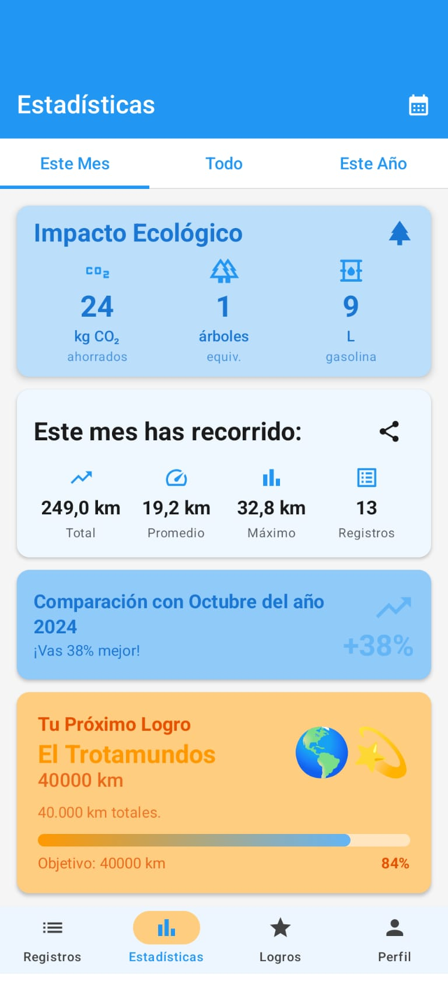
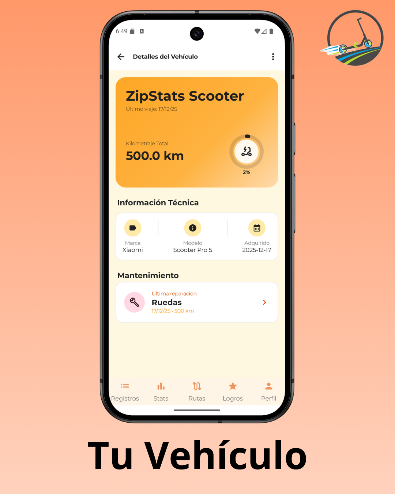
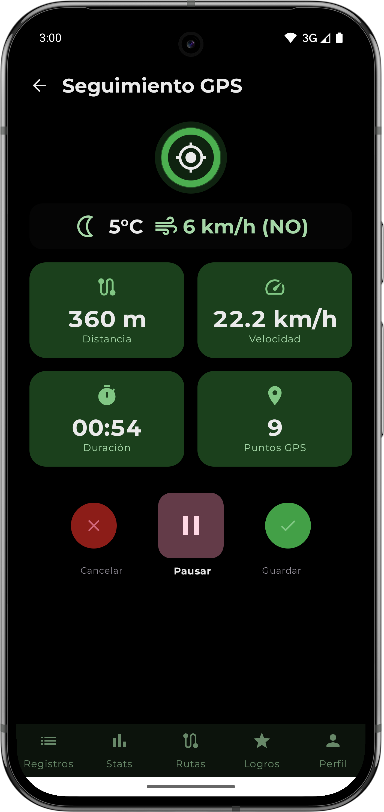
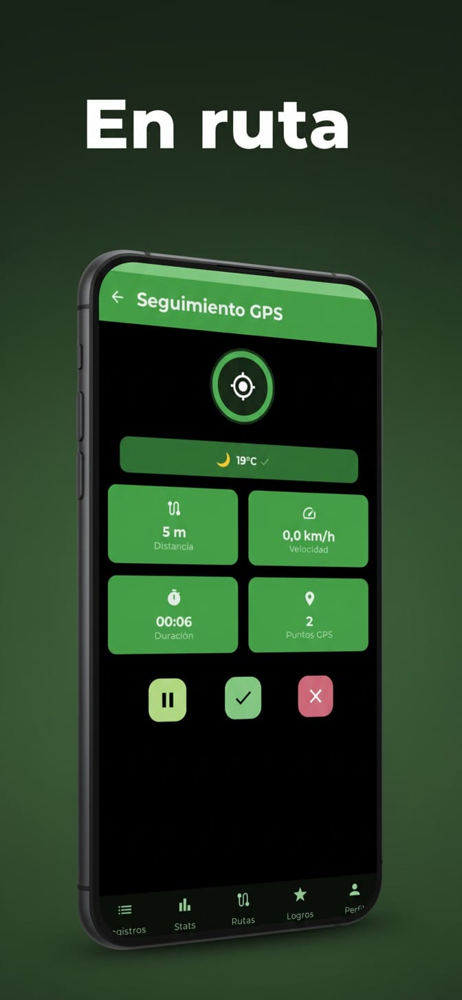
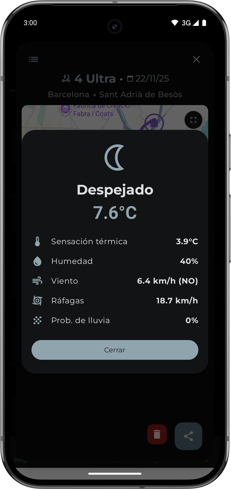
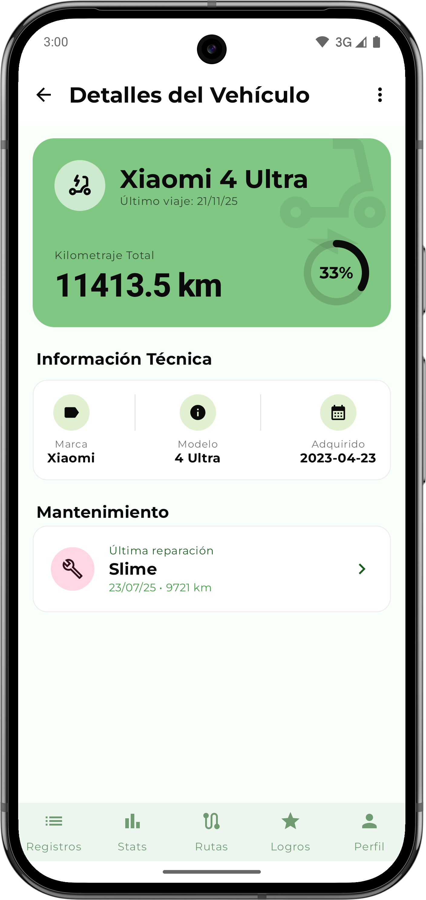
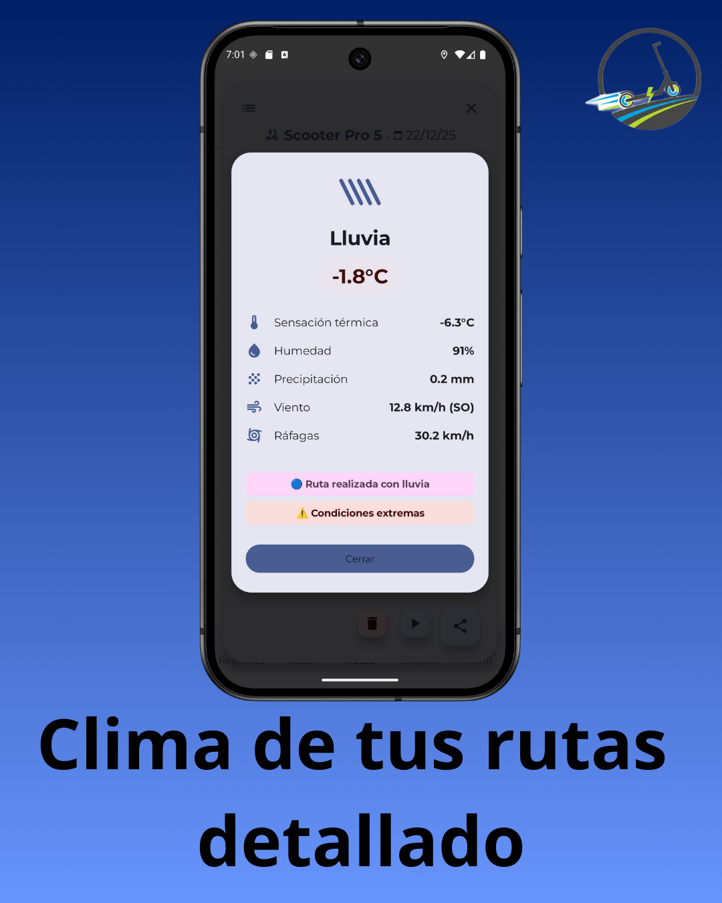

# 🛴 ZipStats

**Aplicación Android para tracking GPS de patinetes, bicicletas y otros vehículos personales.**

[](https://github.com/shurdani/Patinetatrack/releases)
[](https://kotlinlang.org)
[](https://developer.android.com)
[](https://developer.android.com/jetpack/compose)
[](LICENSE)

---

## 📱 **Características Principales**

### 🗺️ **Tracking GPS en Tiempo Real**
- ✅ Seguimiento preciso de rutas con GPS en tiempo real
- ✅ Cálculo automático de distancia, velocidad y duración
- ✅ Visualización interactiva de rutas en Mapbox con estilo personalizado
- ✅ Marcadores personalizados de inicio y final con orientación inteligente
- ✅ Filtrado de ruido GPS para mayor precisión (precisión < 50m)
- ✅ Velocidad = 0 cuando estás parado (filtro inteligente)
- ✅ Servicio en foreground que continúa funcionando en segundo plano
- ✅ Pausa y reanudación del tracking
- ✅ Integración con OpenMeteo API para datos meteorológicos precisos
- ✅ Captura automática del clima al inicio de la ruta
- ✅ Monitoreo continuo del clima cada 10 minutos durante la ruta
- ✅ Preavisos inteligentes de lluvia y condiciones extremas antes de iniciar
- ✅ Detección automática de lluvia durante la ruta con actualización en tiempo real
- ✅ Sistema de calzada mojada con detección probabilística
- ✅ Badges de seguridad en rutas finalizadas (lluvia, calzada mojada, condiciones extremas)
- ✅ Compartir rutas con imágenes de mapas profesionales

### 📊 **Gestión de Vehículos**
- ✅ Registro de múltiples vehículos (patinete, bicicleta, etc.)
- ✅ Seguimiento de kilometraje por vehículo
- ✅ Estadísticas individuales por vehículo
- ✅ Imágenes personalizadas con Cloudinary

### 📈 **Estadísticas y Registros**
- ✅ Historial completo de rutas con visualización en mapa
- ✅ Estadísticas detalladas (distancia total, velocidad promedio/máxima, tiempo en movimiento)
- ✅ Información meteorológica completa por ruta (temperatura, viento, humedad, UV, precipitación)
- ✅ Badges de seguridad que reflejan condiciones adversas durante la ruta
- ✅ Filtrado por fecha y vehículo con índices optimizados de Firebase
- ✅ Análisis post-ruta (porcentaje de tiempo en movimiento, pausas detectadas)
- ✅ Exportación de datos a Excel
- ✅ Recarga automática de componentes cuando es necesario

### 🌦️ **Sistema Meteorológico Inteligente**
- ✅ Preavisos preventivos antes de iniciar la ruta
  - Detección de lluvia activa con aviso azul/rosa
  - Alerta de calzada mojada con aviso amarillo/naranja
  - Advertencia de condiciones extremas (viento fuerte, temperatura extrema, UV alto, tormentas)
- ✅ Monitoreo continuo durante la ruta
  - Chequeo automático cada 10 minutos
  - Actualización en tiempo real del clima cuando se detecta lluvia
  - Confirmación de lluvia con doble verificación para evitar falsos positivos
- ✅ Detección inteligente de lluvia con múltiples reglas:
  - Códigos meteorológicos oficiales
  - Precipitación medida directamente
  - Análisis de humedad y probabilidad de lluvia
  - Detección de diluvios urbanos mediterráneos
- ✅ Badges de seguridad en rutas finalizadas:
  - 🔵 Ruta realizada con lluvia
  - 🟡 Precaución: calzada mojada
  - ⚠️ Condiciones extremas
- ✅ Detección de condiciones extremas:
  - Viento fuerte (>40 km/h) y ráfagas (>60 km/h)
  - Temperaturas extremas (<0°C o >35°C)
  - Índice UV muy alto (>8)
  - Tormentas y fenómenos meteorológicos adversos

### 🎨 **Interfaz Moderna**
- ✅ Diseño Material Design 3
- ✅ Jetpack Compose 100%
- ✅ Navegación intuitiva con Bottom Navigation
- ✅ Tema adaptable
- ✅ Velocímetro con Media Móvil Exponencial para respuesta instantánea
- ✅ Iconografía unificada y consistente

---

## 🚀 **Tecnologías Utilizadas**

### **Core**
- **Lenguaje:** Kotlin
- **UI Framework:** Jetpack Compose
- **Arquitectura:** MVVM + Clean Architecture
- **Inyección de Dependencias:** Hilt (Dagger)

### **APIs y Servicios**
- **Mapbox SDK:** Visualización de mapas y rutas
- **Google Weather API:** Datos meteorológicos en tiempo real y pronósticos
- **Firebase:**
  - Authentication (Email/Password/Google)
  - Firestore Database (Almacenamiento de datos)
  - Storage (Imágenes de perfil)
- **Cloudinary:** Gestión de imágenes de vehículos
- **Location Services:** GPS tracking en tiempo real

### **Otras Librerías**
- **Navigation Compose:** Navegación entre pantallas
- **Coil:** Carga de imágenes
- **DataStore:** Preferencias locales
- **JExcelAPI:** Exportación a Excel
- **Coroutines & Flow:** Programación asíncrona y reactiva

---

## 📋 **Requisitos**

- Android 12 (API 31) o superior
- GPS habilitado
- Google Play Services
- Conexión a Internet (para mapas y sincronización)

---

## 🔧 **Configuración del Proyecto**

### **1. Clonar el Repositorio**

```bash
git clone https://github.com/shurdani/zipstats.git
cd zipstats
```

### **2. Configurar Credenciales**

Configura las siguientes credenciales en `local.properties`:

- ✅ Mapbox Access Token
- ✅ Firebase (google-services.json)
- ✅ Cloudinary Credentials
- ✅ OpenMeteo API (gratuita, sin API key requerida)

**⚠️ IMPORTANTE:** Copia `local.properties.example` a `local.properties` y configura tus credenciales.

### **3. Compilar e Instalar**

```bash
./gradlew clean assembleDebug
./gradlew installDebug
```

---

## 🏗️ **Arquitectura del Proyecto**

```
app/src/main/java/com/zipstats/app/
├── analysis/               # Análisis de datos GPS (filtrado de outliers, detección de pausas)
├── di/                     # Módulos de inyección de dependencias (Hilt)
├── map/                    # Animación y visualización de rutas
├── model/                  # Modelos de datos (Route, Scooter, RoutePoint, User, etc.)
├── navigation/             # Navegación entre pantallas
├── network/                # APIs de red (Cloudinary)
├── permission/             # Gestión de permisos
├── repository/             # Repositorios (capa de datos)
│   └── WeatherRepository   # Integración con OpenMeteo API
├── service/                # Servicios en segundo plano
│   ├── LocationTrackingService  # Servicio de tracking GPS
│   ├── AchievementsService      # Gestión de logros
│   └── NetworkMonitor           # Monitoreo de red
├── tracking/               # Lógica de tracking GPS (LocationTracker, SpeedCalculator)
├── ui/                     # Interfaz de usuario (Jetpack Compose)
│   ├── achievements/       # Pantalla de logros
│   ├── auth/              # Autenticación (login, registro, verificación)
│   ├── components/        # Componentes reutilizables
│   │   └── CapturableMapView  # Componente de mapas Mapbox
│   ├── onboarding/        # Pantalla de bienvenida
│   ├── permissions/       # Diálogos de permisos
│   ├── profile/           # Perfil y gestión de vehículos
│   ├── records/           # Historial de registros
│   ├── repairs/           # Gestión de reparaciones
│   ├── routes/            # Pantalla de rutas y detalles
│   ├── shared/            # Componentes compartidos (overlays, estados)
│   ├── splash/           # Pantalla de inicio
│   ├── statistics/       # Estadísticas y análisis
│   ├── theme/            # Sistema de temas Material Design 3
│   └── tracking/         # Pantalla de tracking GPS en tiempo real
└── utils/                 # Utilidades (formateo, exportación, análisis)
```

---

## 🎯 **Características Técnicas**

### **🗺️ GPS Tracking Optimizado**
- Filtrado de ruido GPS (precisión < 50m)
- Distancia mínima entre puntos (5m) para evitar saltos
- Velocidad filtrada (< 1.5 km/h = 0 km/h)
- Servicio en foreground con notificación persistente
- Cálculo preciso con fórmula Haversine
- Actualización GPS cada 2 segundos
- Media Móvil Exponencial (EMA) para respuesta instantánea del velocímetro

### **🌦️ Sistema Meteorológico Avanzado**
- Integración con OpenMeteo API para datos precisos (gratuita y open-source)
- Captura automática del clima al inicio de cada ruta
- Monitoreo continuo cada 10 minutos durante la ruta
- Detección inteligente de lluvia con 4 reglas diferentes:
  - Códigos meteorológicos oficiales
  - Precipitación medida directamente
  - Análisis probabilístico (humedad + probabilidad)
  - Detección de diluvios urbanos mediterráneos
- Sistema de calzada mojada con consideración día/noche
- Detección de condiciones extremas (viento, temperatura, UV, tormentas)
- Preavisos preventivos antes de iniciar la ruta
- Actualización en tiempo real del clima cuando se detecta lluvia
- Badges de seguridad que reflejan el estado más adverso durante la ruta

### **⚡ Rendimiento**
- Carga lazy de imágenes con Coil
- Reactive data streams con Flow
- Optimización de memoria con LazyColumn
- Índices de Firebase optimizados para consultas rápidas
- Gestión de estado reactiva con recarga automática

### **🔒 Seguridad**
- Autenticación Firebase
- Reglas de seguridad Firestore
- API Keys protegidas (no hardcodeadas)
- Restricciones de API Key por package name y SHA-1

---

## 📱 **Capturas de Pantalla**

<p align="center">
  
  
  
</p>

<p align="center">
  
  
  
</p>

<p align="center">
  
  
  
</p>

---

## 🤝 **Contribuir**

¡Las contribuciones son bienvenidas! Por favor:

1. Fork el proyecto
2. Crea una rama para tu feature (`git checkout -b feature/AmazingFeature`)
3. Commit tus cambios (`git commit -m 'Add some AmazingFeature'`)
4. Push a la rama (`git push origin feature/AmazingFeature`)
5. Abre un Pull Request

**⚠️ IMPORTANTE:** Asegúrate de que tu código sigue las mejores prácticas de seguridad antes de hacer commit.

---

## 📄 **Licencia**

Este proyecto está bajo la Licencia Pública General GNU v3 (GPLv3). Consulta el archivo [LICENSE](LICENSE) para más detalles.  
El nombre "ZipStats", su logotipo y elementos visuales están protegidos como identidad del autor. No se permite su uso en aplicaciones derivadas sin autorización expresa.

---

## 👥 **Autores**

- **[Shurdani]** - *Desarrollo inicial* - [Shurdani](https://github.com/Shurdani)

---

## 🙏 **Agradecimientos**

- Mapbox por la plataforma de mapas
- OpenMeteo por los datos meteorológicos precisos y gratuitos
- Firebase por los servicios backend
- Cloudinary por la gestión de imágenes
- La comunidad de Android y Jetpack Compose

---

## 📞 **Contacto**

¿Preguntas? ¿Sugerencias? ¿Encontraste un bug?

- 📧 Email: zipstatsapp@gmail.com
- 🐛 Issues: [GitHub Issues](https://github.com/shurdani/Patinetatrack/issues)

---

## 🔮 **Próximas Características**

- [ ] Modo offline para tracking sin conexión
- [ ] Exportación de rutas en formato GPX
- [ ] Compartir rutas con otros usuarios
- [ ] Estadísticas avanzadas con gráficos
- [ ] Integración con wearables (smartwatch)
- [ ] Modo oscuro automático según hora del día
- [ ] Notificaciones de recordatorios de mantenimiento
- [ ] Historial meteorológico detallado por ruta
- [ ] Alertas de condiciones meteorológicas adversas en tiempo real

---

**¡Feliz Tracking! 🚀🛴**
