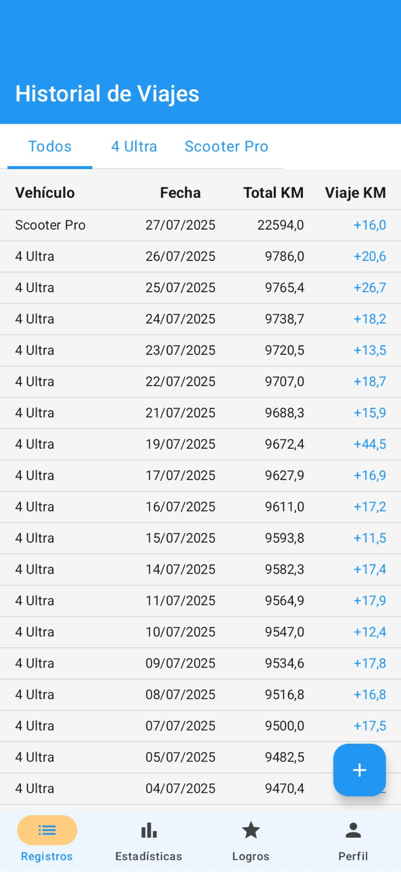
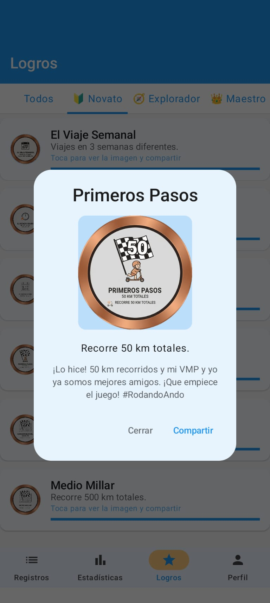
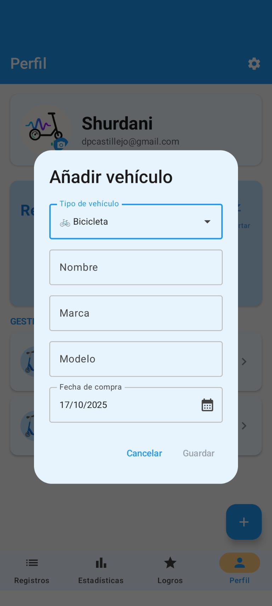
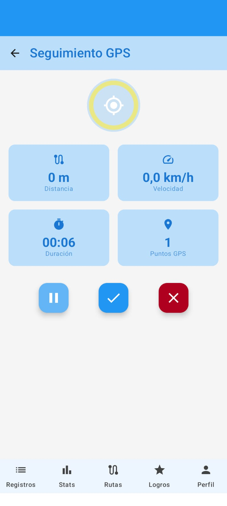

# 🛴 ZipStats

**Aplicación Android para tracking GPS de patinetes, bicicletas y otros vehículos personales.**

[](https://github.com/shurdani/Patinetatrack/releases)
[](https://kotlinlang.org)
[](https://developer.android.com)
[](https://developer.android.com/jetpack/compose)
[](LICENSE)

---

## 📱 **Características Principales**

### 🗺️ **Tracking GPS en Tiempo Real**
- ✅ Seguimiento preciso de rutas con GPS en tiempo real
- ✅ Cálculo automático de distancia, velocidad y duración
- ✅ Visualización interactiva de rutas en Google Maps con estilo personalizado
- ✅ Marcadores personalizados de inicio y final con orientación inteligente
- ✅ Filtrado de ruido GPS para mayor precisión (precisión < 50m)
- ✅ Velocidad = 0 cuando estás parado (filtro inteligente)
- ✅ Servicio en foreground que continúa funcionando en segundo plano
- ✅ Pausa y reanudación del tracking
- ✅ Captura automática del clima al inicio de la ruta
- ✅ Compartir rutas con imágenes de mapas profesionales

### 📊 **Gestión de Vehículos**
- ✅ Registro de múltiples vehículos (patinete, bicicleta, etc.)
- ✅ Seguimiento de kilometraje por vehículo
- ✅ Estadísticas individuales por vehículo
- ✅ Imágenes personalizadas con Cloudinary

### 📈 **Estadísticas y Registros**
- ✅ Historial completo de rutas con visualización en mapa
- ✅ Estadísticas detalladas (distancia total, velocidad promedio/máxima, tiempo en movimiento)
- ✅ Filtrado por fecha y vehículo con índices optimizados de Firebase
- ✅ Análisis post-ruta (porcentaje de tiempo en movimiento, pausas detectadas)
- ✅ Exportación de datos a Excel
- ✅ Recarga automática de componentes cuando es necesario

### 🎨 **Interfaz Moderna**
- ✅ Diseño Material Design 3
- ✅ Jetpack Compose 100%
- ✅ Navegación intuitiva con Bottom Navigation
- ✅ Tema adaptable
- ✅ Velocímetro con Media Móvil Exponencial para respuesta instantánea
- ✅ Iconografía unificada y consistente

---

## 🚀 **Tecnologías Utilizadas**

### **Core**
- **Lenguaje:** Kotlin
- **UI Framework:** Jetpack Compose
- **Arquitectura:** MVVM + Clean Architecture
- **Inyección de Dependencias:** Hilt (Dagger)

### **APIs y Servicios**
- **Google Maps SDK:** Visualización de mapas y rutas
- **Firebase:**
  - Authentication (Email/Password/Google)
  - Firestore Database (Almacenamiento de datos)
  - Storage (Imágenes de perfil)
- **Cloudinary:** Gestión de imágenes de vehículos
- **Location Services:** GPS tracking en tiempo real

### **Otras Librerías**
- **Navigation Compose:** Navegación entre pantallas
- **Coil:** Carga de imágenes
- **DataStore:** Preferencias locales
- **JExcelAPI:** Exportación a Excel
- **Coroutines & Flow:** Programación asíncrona y reactiva

---

## 📋 **Requisitos**

- Android 12 (API 31) o superior
- GPS habilitado
- Google Play Services
- Conexión a Internet (para mapas y sincronización)

---

## 🔧 **Configuración del Proyecto**

### **1. Clonar el Repositorio**

```bash
git clone https://github.com/shurdani/Patinetatrack.git
cd Patinetatrack
```

### **2. Configurar Credenciales**

Configura las siguientes credenciales en `local.properties`:

- ✅ Google Maps API Key
- ✅ Firebase (google-services.json)
- ✅ Cloudinary Credentials
- ✅ OpenWeather API Key

**⚠️ IMPORTANTE:** Copia `local.properties.example` a `local.properties` y configura tus credenciales.

### **3. Compilar e Instalar**

```bash
./gradlew clean assembleDebug
./gradlew installDebug
```

---

## 🏗️ **Arquitectura del Proyecto**

```
app/src/main/java/com/zipstats/app/
├── di/                     # Módulos de inyección de dependencias (Hilt)
├── model/                  # Modelos de datos (Route, Scooter, RoutePoint)
├── repository/             # Repositorios (capa de datos)
├── service/                # Servicio de tracking GPS
├── ui/                     # Interfaz de usuario (Compose)
│   ├── components/         # Componentes reutilizables de mapas
│   ├── tracking/           # Pantalla de tracking GPS
│   ├── routes/             # Pantalla de rutas
│   ├── records/            # Pantalla de registros
│   ├── statistics/         # Pantalla de estadísticas
│   └── profile/            # Pantalla de perfil
├── navigation/             # Navegación entre pantallas
├── permission/             # Gestión de permisos
└── util/                   # Utilidades
```

---

## 🎯 **Características Técnicas**

### **🗺️ GPS Tracking Optimizado**
- Filtrado de ruido GPS (precisión < 50m)
- Distancia mínima entre puntos (5m) para evitar saltos
- Velocidad filtrada (< 1.5 km/h = 0 km/h)
- Servicio en foreground con notificación persistente
- Cálculo preciso con fórmula Haversine
- Actualización GPS cada 2 segundos
- Media Móvil Exponencial (EMA) para respuesta instantánea del velocímetro

### **⚡ Rendimiento**
- Carga lazy de imágenes con Coil
- Reactive data streams con Flow
- Optimización de memoria con LazyColumn
- Índices de Firebase optimizados para consultas rápidas
- Gestión de estado reactiva con recarga automática

### **🔒 Seguridad**
- Autenticación Firebase
- Reglas de seguridad Firestore
- API Keys protegidas (no hardcodeadas)
- Restricciones de API Key por package name y SHA-1

---

## 📱 **Capturas de Pantalla**

<p align="center">
  
  
  
</p>

<p align="center">
  
  
  
</p>

<p align="center">
  
  
  
</p>

---

## 🤝 **Contribuir**

¡Las contribuciones son bienvenidas! Por favor:

1. Fork el proyecto
2. Crea una rama para tu feature (`git checkout -b feature/AmazingFeature`)
3. Commit tus cambios (`git commit -m 'Add some AmazingFeature'`)
4. Push a la rama (`git push origin feature/AmazingFeature`)
5. Abre un Pull Request

**⚠️ IMPORTANTE:** Asegúrate de que tu código sigue las mejores prácticas de seguridad antes de hacer commit.

---

## 📄 **Licencia**

Este proyecto está bajo la Licencia Pública General GNU v3 (GPLv3). Consulta el archivo [LICENSE](LICENSE) para más detalles.  
El nombre "ZipStats", su logotipo y elementos visuales están protegidos como identidad del autor. No se permite su uso en aplicaciones derivadas sin autorización expresa.

---

## 👥 **Autores**

- **[Shurdani]** - *Desarrollo inicial* - [Shurdani](https://github.com/Shurdani)

---

## 🙏 **Agradecimientos**

- Google Maps Platform por la API de mapas
- Firebase por los servicios backend
- Cloudinary por la gestión de imágenes
- La comunidad de Android y Jetpack Compose

---

## 📞 **Contacto**

¿Preguntas? ¿Sugerencias? ¿Encontraste un bug?

- 📧 Email: zipstatsapp@gmail.com
- 🐛 Issues: [GitHub Issues](https://github.com/shurdani/Patinetatrack/issues)

---

## 🔮 **Próximas Características**

- [ ] Modo offline para tracking sin conexión
- [ ] Exportación de rutas en formato GPX
- [ ] Compartir rutas con otros usuarios
- [ ] Estadísticas avanzadas con gráficos
- [ ] Integración con wearables (smartwatch)
- [ ] Modo oscuro automático según hora del día
- [ ] Notificaciones de recordatorios de mantenimiento

---

**¡Feliz Tracking! 🚀🛴**
