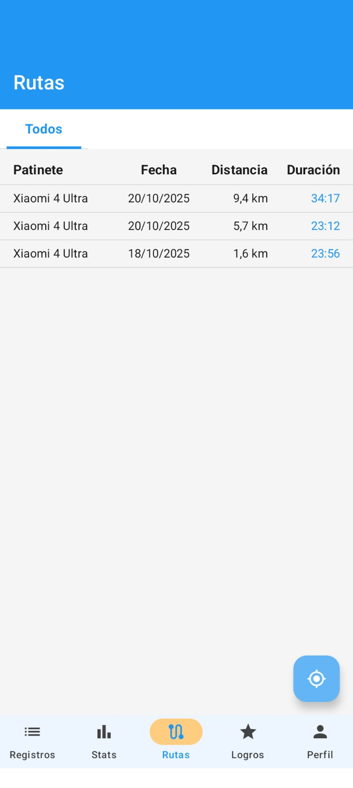
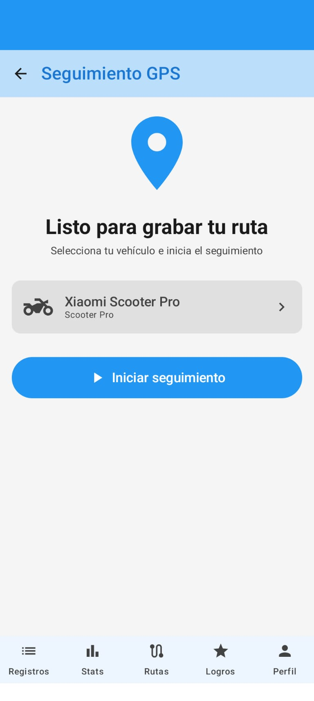

# 🛴 ZipStats

**Aplicación Android para tracking GPS de patinetes, bicicletas y otros vehículos personales.**

[](https://kotlinlang.org)
[](https://developer.android.com)
[](https://developer.android.com/jetpack/compose)
[](LICENSE)

---

## 📱 **Características Principales**

### 🗺️ **Tracking GPS en Tiempo Real**
- ✅ Seguimiento preciso de rutas con GPS
- ✅ Cálculo en tiempo real de distancia, velocidad y duración
- ✅ Visualización de rutas en Google Maps
- ✅ Marcadores de inicio y final de ruta
- ✅ Filtrado de ruido GPS para mayor precisión
- ✅ Velocidad = 0 cuando estás parado (filtro inteligente)
- ✅ **Navegación mejorada** - Transición directa al finalizar rutas
- ✅ **Recarga automática de mapas** - Se recargan al volver del background
- ✅ **Compartir rutas** - Exportación de imágenes de mapas

### 📊 **Gestión de Vehículos**
- ✅ Registro de múltiples vehículos (patinete, bicicleta, etc.)
- ✅ Seguimiento de kilometraje por vehículo
- ✅ Estadísticas individuales por vehículo
- ✅ Imágenes personalizadas (Cloudinary)

### 📈 **Estadísticas y Registros**
- ✅ Historial completo de rutas
- ✅ Estadísticas detalladas (distancia total, velocidad promedio/máxima)
- ✅ Visualización de rutas guardadas en mapa
- ✅ Filtrado por fecha y vehículo
- ✅ Exportación a Excel
- ✅ **Filtrado optimizado por patinete** - Con índices de Firebase
- ✅ **Gestión de estado mejorada** - Recarga automática de datos

### 🎨 **Interfaz Moderna**
- ✅ Diseño Material Design 3
- ✅ Jetpack Compose
- ✅ Navegación intuitiva con Bottom Navigation
- ✅ Tema adaptable
- ✅ Experiencia de usuario optimizada

---

## 🆕 **Novedades en la Versión 2.5**

### **🚀 IMPLEMENTACIÓN COMPLETA DEL SISTEMA DE RUTAS**

#### **🗺️ Pantalla de Rutas - NUEVA**
- **Historial completo** - Visualización de todas las rutas guardadas por patinete
- **Visualización en mapa** - Cada ruta se muestra en un mapa interactivo con Google Maps
- **Marcadores inteligentes** - Punto de inicio (verde) y punto final (rojo) en cada ruta
- **Información detallada** - Distancia, duración, velocidad promedio y máxima
- **Filtrado por patinete** - Consultas optimizadas con índices de Firebase
- **Compartir rutas** - Exportación de imagen del mapa de cada ruta
- **Recarga automática** - Los mapas se recargan al volver del background

#### **📊 Sistema de Tracking GPS Completo**
- **Seguimiento en tiempo real** - GPS tracking con actualización cada 2 segundos
- **Servicio en foreground** - Continúa funcionando en segundo plano
- **Pausa/Reanudación** - Control completo del tracking durante la ruta
- **Cálculos precisos** - Distancia (Haversine), velocidad en tiempo real, duración
- **Filtrado inteligente** - Eliminación de ruido GPS y puntos imprecisos
- **Guardado en Firebase** - Persistencia de rutas con todos los puntos GPS
- **Asociación a patinete** - Cada ruta se vincula al patinete activo

#### **🗂️ Gestión Avanzada de Rutas**
- **Múltiples vistas de mapa** - Componentes optimizados para diferentes contextos
- **Navegación fluida** - Transición directa al finalizar/cancelar rutas
- **Índices de Firebase** - Consultas optimizadas por usuario + patinete + fecha
- **Lifecycle management** - Gestión inteligente del ciclo de vida de mapas
- **State management** - Recarga automática de componentes cuando es necesario
- **Error handling** - Manejo robusto de errores en carga de mapas

#### **🎨 Componentes de Mapas Implementados**
- **CapturableMapView** - Para capturar y compartir imágenes de rutas
- **RouteMapView** - Vista detallada de rutas con zoom automático
- **BasicMapView** - Vista básica optimizada para listas
- **SimpleMapView** - Vista simplificada para previews
- Todos con **recarga automática** al volver del background

---

## 🚀 **Tecnologías Utilizadas**

### **Core**
- **Lenguaje:** Kotlin
- **UI Framework:** Jetpack Compose
- **Arquitectura:** MVVM + Clean Architecture
- **Inyección de Dependencias:** Hilt (Dagger)

### **APIs y Servicios**
- **Google Maps SDK:** Visualización de mapas y rutas
- **Firebase:**
  - Authentication (Email/Password)
  - Firestore Database (Almacenamiento de datos)
  - Storage (Imágenes de perfil)
- **Cloudinary:** Gestión de imágenes de vehículos
- **Location Services:** GPS tracking en tiempo real

### **Otras Librerías**
- **Navigation Compose:** Navegación entre pantallas
- **Coil:** Carga de imágenes
- **DataStore:** Preferencias locales
- **JExcelAPI:** Exportación a Excel
- **Coroutines & Flow:** Programación asíncrona y reactiva

---

## 📋 **Requisitos**

- Android 12 (API 31) o superior
- GPS habilitado
- Google Play Services
- Conexión a Internet (para mapas y sincronización)

---

## 🔧 **Configuración del Proyecto**

### **1. Clonar el Repositorio**

```bash
git clone https://github.com/shurdani/Patinetatrack.git
cd Patinetatrack
```

### **2. Configurar Credenciales**

Consulta la [Guía de Configuración Detallada (SETUP.md)](SETUP.md) para obtener instrucciones completas sobre cómo configurar:

- ✅ Google Maps API Key
- ✅ Firebase (google-services.json)
- ✅ Cloudinary Credentials

**⚠️ IMPORTANTE:** Copia `local.properties.example` a `local.properties` y configura tus credenciales.

### **3. Compilar e Instalar**

```bash
./gradlew clean assembleDebug
./gradlew installDebug
```

---

## 📖 **Documentación**

- 📘 [Guía de Configuración (SETUP.md)](SETUP.md)
- 🔒 [Checklist de Seguridad (SECURITY_CHECKLIST.md)](SECURITY_CHECKLIST.md)
- 🗺️ [Configuración de Google Maps (GOOGLE_MAPS_SETUP.md)](GOOGLE_MAPS_SETUP.md)
- 📍 [Implementación GPS (GPS_IMPLEMENTATION_SUMMARY.md)](GPS_IMPLEMENTATION_SUMMARY.md)
- 🐛 [Solución de Problemas GPS (SOLUCION_PROBLEMAS_GPS.md)](SOLUCION_PROBLEMAS_GPS.md)

---

## 🏗️ **Arquitectura del Proyecto**

```
app/src/main/java/com/zipstats/app/
├── di/                     # Módulos de inyección de dependencias (Hilt)
├── model/                  # Modelos de datos
│   ├── Route.kt           # Modelo de ruta con puntos GPS
│   ├── Scooter.kt         # Modelo de vehículo
│   └── RoutePoint.kt      # Punto GPS individual
├── repository/             # Repositorios (capa de datos)
│   ├── RouteRepository.kt  # Gestión de rutas en Firebase
│   └── ScooterRepository.kt
├── service/                # Servicios
│   └── LocationTrackingService.kt  # Servicio de tracking GPS
├── ui/                     # Interfaz de usuario (Compose)
│   ├── components/         # Componentes reutilizables
│   │   ├── CapturableMapView.kt    # Mapa capturable para compartir
│   │   ├── RouteMapView.kt         # Vista detallada de rutas
│   │   ├── BasicMapView.kt         # Vista básica de rutas
│   │   └── SimpleMapView.kt        # Vista simplificada
│   ├── tracking/           # Pantalla de tracking GPS
│   ├── routes/             # Pantalla de rutas (NUEVO)
│   ├── records/            # Pantalla de registros
│   ├── statistics/         # Pantalla de estadísticas
│   └── profile/            # Pantalla de perfil
├── navigation/             # Navegación entre pantallas
├── permission/             # Gestión de permisos
├── util/                   # Utilidades (LocationUtils, etc.)
└── PatinetaApplication.kt  # Clase Application (Hilt)
```

---

## 🎯 **Características Técnicas Destacadas**

### **🗺️ GPS Tracking Optimizado**
- Filtrado de ruido GPS (precisión < 50m)
- Distancia mínima entre puntos (5m) para evitar saltos
- Velocidad filtrada (< 1.5 km/h = 0 km/h)
- Servicio en foreground con notificación persistente
- Pausa/reanudación del tracking
- Cálculo preciso con fórmula Haversine
- **Navegación fluida** - Transición directa al finalizar rutas
- **Recarga inteligente de mapas** - Detección automática de cambios de estado

### **⚡ Rendimiento**
- Actualización GPS cada 2 segundos
- Carga lazy de imágenes con Coil
- Reactive data streams con Flow
- Optimización de memoria con LazyColumn
- **Índices de Firebase optimizados** - Consultas más rápidas por patinete
- **Gestión de estado reactiva** - Recarga automática de componentes

### **🔒 Seguridad**
- Autenticación Firebase
- Reglas de seguridad Firestore
- API Keys protegidas (no hardcodeadas)
- Restricciones de API Key por package name y SHA-1

---

## 📱 **Capturas de Pantalla**

<p align="center">
  
  
  
</p>

<p align="center">
  
  
  
</p>

<p align="center">
  
</p>

---

## 🧪 **Testing**

```bash
# Tests unitarios
./gradlew test

# Tests de instrumentación
./gradlew connectedAndroidTest
```

---

## 🤝 **Contribuir**

¡Las contribuciones son bienvenidas! Por favor:

1. Fork el proyecto
2. Crea una rama para tu feature (`git checkout -b feature/AmazingFeature`)
3. Commit tus cambios (`git commit -m 'Add some AmazingFeature'`)
4. Push a la rama (`git push origin feature/AmazingFeature`)
5. Abre un Pull Request

**⚠️ IMPORTANTE:** Revisa el [Checklist de Seguridad](SECURITY_CHECKLIST.md) antes de hacer commit.

---

## 📄 **Licencia**

Este proyecto está bajo la Licencia MIT - ver el archivo [LICENSE](LICENSE) para más detalles.

---

## 👥 **Autores**

- **[Shurdani]** - *Desarrollo inicial* - [Shurdani](https://github.com/Shurdani)

---

## 🙏 **Agradecimientos**

- Google Maps Platform por la API de mapas
- Firebase por los servicios backend
- Cloudinary por la gestión de imágenes
- La comunidad de Android y Jetpack Compose

---

## 📞 **Contacto**

¿Preguntas? ¿Sugerencias? ¿Encontraste un bug?

- 📧 Email: dpcastillejo@gmail.com
- 🐛 Issues: [GitHub Issues](https://github.com/shurdani/Patinetatrack/issues)

---

## 🗺️ **Roadmap**

### **Versión 2.5 - SISTEMA DE RUTAS COMPLETO** ✅
- [x] **Pantalla de Rutas** - Visualización completa de historial por patinete
- [x] **Visualización en mapas** - Cada ruta se muestra en un mapa interactivo
- [x] **Tracking GPS completo** - Seguimiento en tiempo real con todos los cálculos
- [x] **Guardado de rutas** - Persistencia en Firebase con todos los puntos GPS
- [x] **Filtrado optimizado** - Consultas con índices compuestos de Firebase
- [x] **Compartir rutas** - Exportación de imágenes de mapas
- [x] **Componentes de mapas** - 4 tipos diferentes según contexto
- [x] **Recarga automática** - Lifecycle management para mapas
- [x] **Navegación fluida** - UX mejorada en transiciones
- [x] **Asociación a patinetes** - Cada ruta vinculada al vehículo activo

### **Próximas Características**
- [ ] Modo offline para tracking sin conexión
- [ ] Exportación de rutas en formato GPX
- [ ] Compartir rutas con otros usuarios
- [ ] Estadísticas avanzadas con gráficos
- [ ] Integración con wearables (smartwatch)
- [ ] Modo oscuro automático según hora del día
- [ ] Notificaciones de recordatorios de mantenimiento

---

**¡Feliz Tracking! 🚀🛴**
